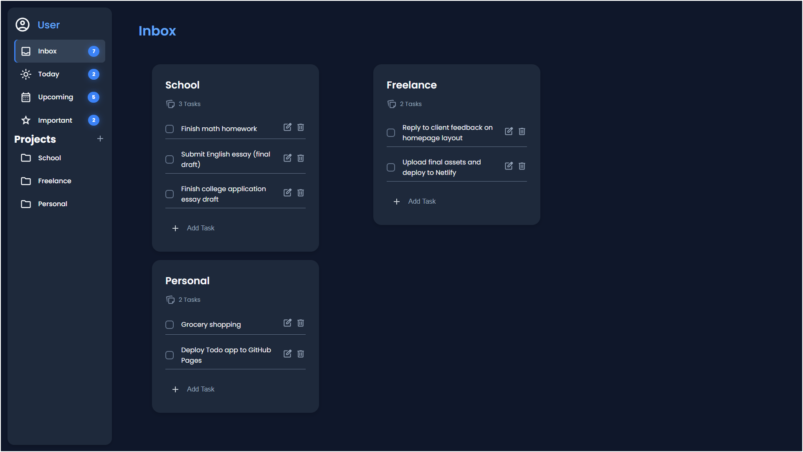

# To-Do

A To-Do app made with HTML, CSS, and JavaScript that lets you track tasks and projects, with your data saved in the browser for easy access anytime.

🔗 **Live Preview**: [Launch App](https://rycatt.github.io/todo-list/)


## 📸 Screenshot



## 🛠️ Installation

> **Note:** The app is also playable live on [GitHub Pages](https://rycatt.github.io/todo-list/).

1. Clone the repository**  
  ```bash
  git clone https://github.com/rycatt/todo-list.git
  ```
2. Navigate to the project folder
  ```bash
  cd todo-list
  ```
3. Open `index.html` in your browser to use the app.

<br>

## 🚀 Features

- Add, edit, and delete tasks
- Create and manage custom projects
- View tasks by: Today, Upcoming, or Important
- Assign priority levels (High, Medium, Low)
- Badge counters for active task count
- Persistent storage using LocalStorage
- Responsive UI with smooth animations

<br>

## 📚 What I Learned

- Applied modular JavaScript structure using ES6 Modules  
- Followed the **Single Responsibility Principle** across modules (UI, storage, project, task logic)  
- Organized logic into reusable and maintainable components  
- Learned to save user data in the browser with `localStorage`, keeping it even after page reloads or closing the tab  
- Designed responsive layouts using CSS Flexbox and Grid  
- Practiced DOM manipulation and event delegation to build an interactive user experience  

<br>

## Built With
- 
- 
- 

<br>

## 📜 License

- [MIT License](https://github.com/rycatt/todo-list/blob/bbad6f026796f996160617065af5dc5c7e127b40/LICENSE)
- Copyright © 2025 - **[@rycatt](https://github.com/rycatt)**

<br>

## ✍️ Author

Created by **[@rycatt](https://github.com/rycatt)**  
Built with guidance from The Odin Project 🙌
